# UnholyEXE

Remember, Terry zealously blessed the PCNet driver.

### Resources Used

[ZealOS-wiki](https://zeal-operating-system.github.io/ZealOS-wiki/)

[ZealOS Discord](https://discord.gg/rK6U3xdr7D)

[Running the ZealOS Gopher Browser (Virtual Box only) - YouTube](https://www.youtube.com/watch?v=eFaMYuggM80)

[ZealOS Documentation](https://zeal-operating-system.github.io/)

### Tools Used

[ImHex](https://github.com/WerWolv/ImHex)

[Ghidra](https://ghidra-sre.org/)

[VirtualBox](https://www.virtualbox.org/)

[ImDisk](https://sourceforge.net/projects/imdisk-toolkit/)

I began by downloading and viewing the `chal.bin` file in a hex editor. Inspecting the contents, I noticed some strings related to networking, such as `Trying to accept a connection`. In addition, there were some strings that seemed to be type or function names, like `DCDel` and `_CLAMP_I64`. Using Github search for these strings, many of the results were related to TempleOS, such as Shrine or TinkerOS. After viewing some of these projects, based on the hint text, I decided ZealOS was the right choice to keep looking at, due to its networking support and name.

In the meantime, I loaded `chal.bin` into Ghidra, but the current decompilation result was meaningless.

I installed ZealOS through VirtualBox.

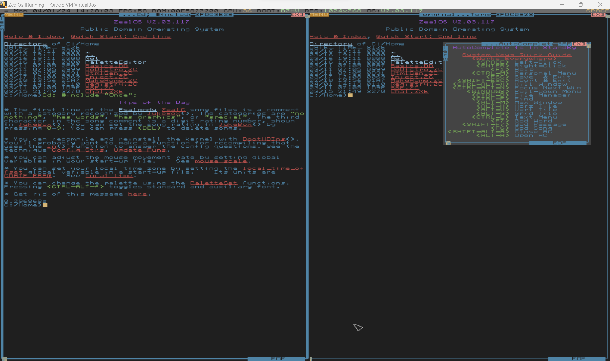

My instinct was to try to get the `chal.bin` binary into ZealOS and run it there. I initially thought that I might be able to redownload `chal.bin` from the CTF page directly in ZealOS. I joined the ZealOS Discord to try and get more information about how networking is performed.

As a fun note, I found the challenge creator's [blog post](https://retu2libc.github.io/posts/aot-compiling-zealc.html) discussing some of the steps they took to create the challenge. Based on this information, the binary file was a `.ZXE` file, which is the pre-compiled executable for ZealOS, which matched with the magic number visible within the file.

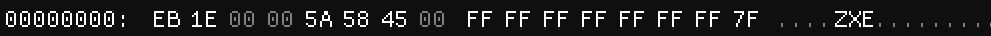

To setup networking within ZealOS, I needed to navigate to the `~/Net` folder and System Include the `Start.ZC` script. Although I was using the PCNet driver within VirtualBox (which seemed to be the default option), networking was not working.

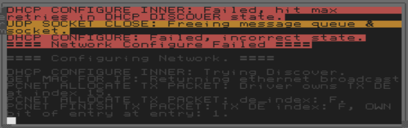

However, I learned how to access the ZealOS filesystem from within my host OS. To open the ZealOS filesystem, I used the Mount Image application from ImDisk. Once mounted, I renamed `chal.bin` as `Chal.ZXE`, moved it into the filesystem, and unmounted the filesystem.

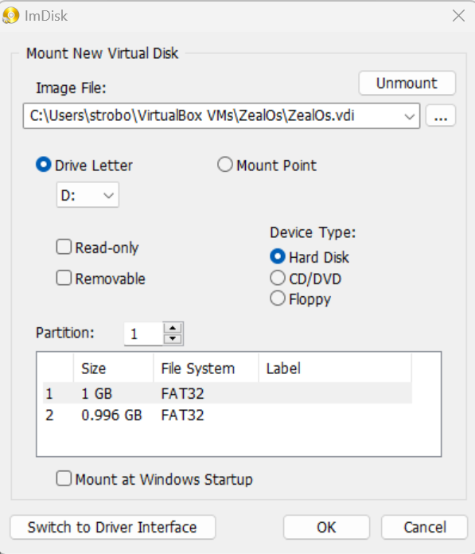

(In the screenshot, 2 filesystems are visible. I wasn't sure which to use, so I just moved `Chal.ZXE` into both of them.)

Then, I could reboot into ZealOS and run the pre-compiled binary with `Load("Chal.ZXE");` while in the same directory as the file:

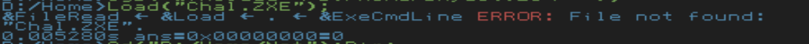

I needed to include the network `Start.ZC` so that all the functions names were known, but networking still didn't work:

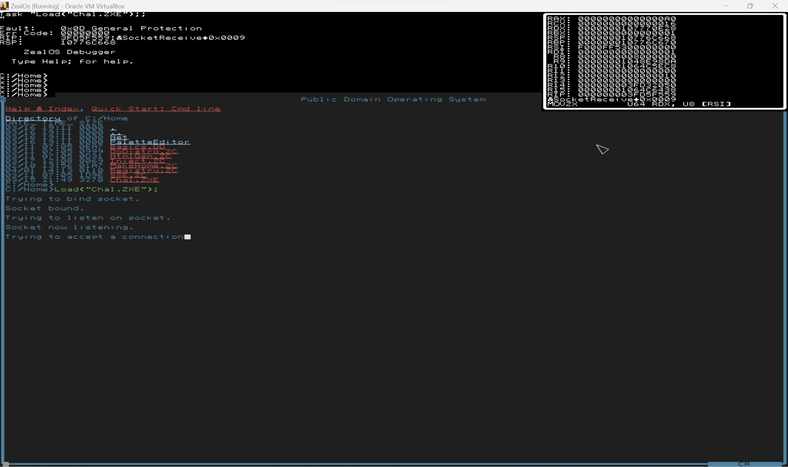

However, I could "inject" my own versions of the TCPSocketReceive to "receive" whatever network data I wanted. I wrote `Inject.ZC` to replace the networking functions with my own. After trying to accept a connection for some time, and presumably timing out, it would receive data from the injected function. But, sending data resulted in garbage:

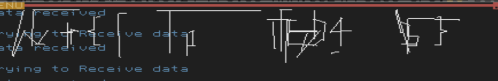

Some characters of the flag, such as `wctf{...}` seemed recognizable as a flag, so I certainly felt like I was making progress.

At this point, I needed to be able to decompile the binary to reverse engineer it and understand what was going on. From browsing Discord, I learned about the `ZXERep` function, which outputs information about `.ZXE` binaries:

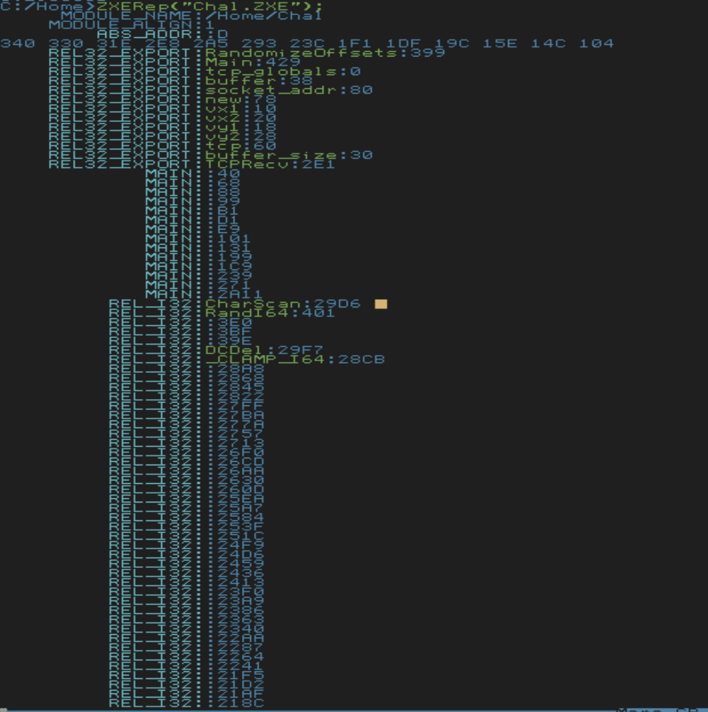

I chose to look at `ZXERep` to learn about the file format for `ZXE` executables. Essentially, the executable begins with some header information, which includes pointers to tables that specify how patch in functions.

I wanted to be able to get a nice decompilation from Ghidra to easily see what was going on. I spent a significant amount of time manually patching the binary within Ghidra to achieve this. To do this, I created a dummy memory block that would contain all the external referenced functions by using Ghidra's Memory Map feature.

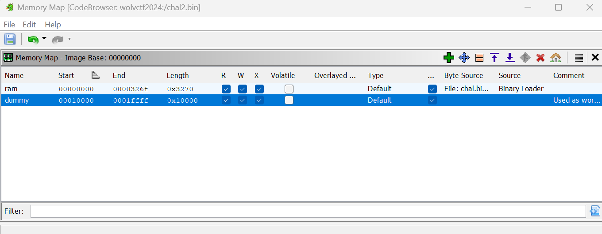

I created all the external functions in this memory block:

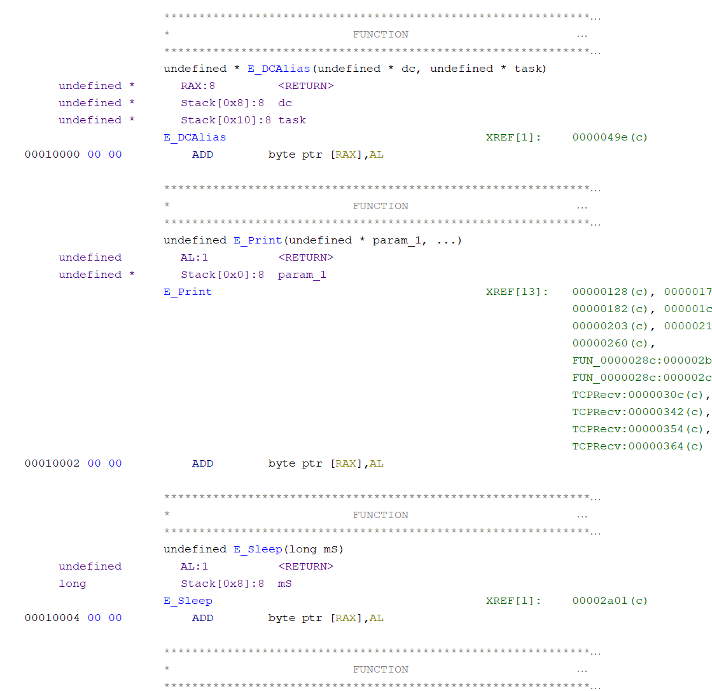

Then, I manually patched all the branch instructions to the correct function, as specified by the `ZXE` format.

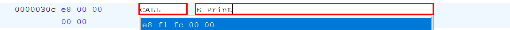

Finally, I modified the calling convention for multiple functions.

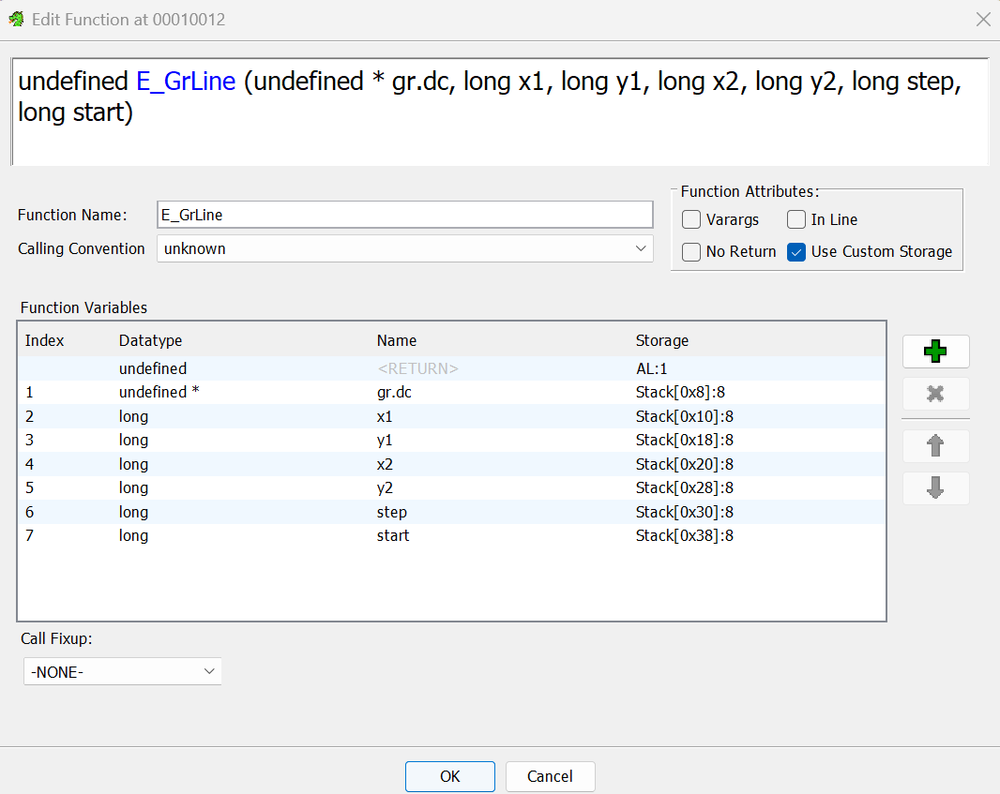

The result was a very nice decompilation that was obviously drawing something on the screen.

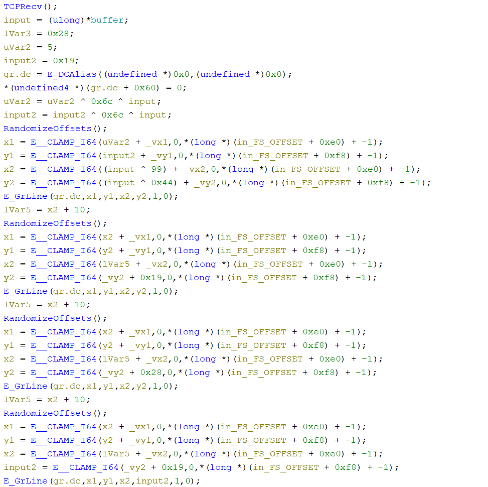 The resulting Ghidra program is provided with this writeup (`chal.gzf`).

Initially, I was trying to input the flag into the network input (beginning the input with `w`, `c`, `t`, `f`, `{`, ...), but that was still giving messy output. I also injected a random function that would always return 0 to see if that would give readable results. I ended up trying to input the numbers that were XORed within the decompilation, and that resulted in a very clean output. The final `Inject.ZC` is provided with this writeup.

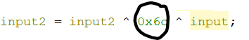

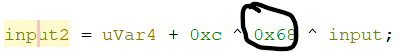

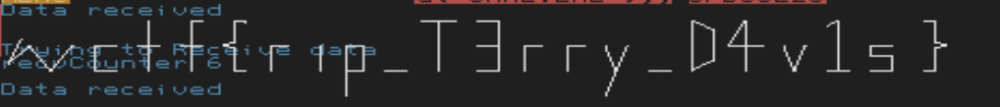

`wctf{rip_T3rry_D4v1s}`
